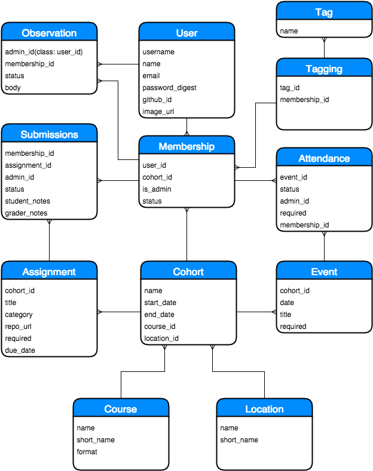

[](https://travis-ci.org/ga-dc/garnet/)

# Garnet

Garnet is a collaboration by the instructors of GA's WDI Program to produce a student data-tracking app that's better than Google Sheets.

### Please fork, clone, and contribute!

### Current features:

- Extensibility across courses and cohorts
- Mobile-friendly attendance-taking
- Integration with Github
  - Keep track of students' and instructors' Github information
  - Track issues, pull requests, and forks
- A "Report Card" functionality that shows students their current attendance and assignment turn-in rates
- Leave detailed notes on homework submissions in Markdown format
- Leave detailed observations on students in Markdown format
- Admin and nonadmin roles

## Local Setup

1. `$ git clone https://github.com/ga-dc/garnet`
- `$ cd garnet`
- Install headless browser for js features
  - `$ brew install phantomjs`
  - If you get an error about installing on Yosemite (or later), we need phantom 2.x.  Download the latest 2.x from https://github.com/Vitallium/phantomjs/releases and copy `phantomjs` to `/usr/local/bin`.
- `$ bundle install`
- `$ rake db:create`
- `$ rake db:schema:load`
  - Note: migrations are **not** designed to be run from a new DB
- `$ rake db:seed`
  - Note: this generates a decent amount of data and can take up to 1 minute
- `$ bundle exec figaro install`
- [Register a Github application](https://github.com/settings/applications) and update `config/application.yml` to look like this:

    ```
    gh_client_id: "12345"
    gh_client_secret: "67890"
    gh_redirect_url: "http://localhost:3000/github/authenticate"
    ```

9. `$ rspec -f d`
10. `$ rails s`
12. Log in with username `adam` and password `password`
13. Enter the Konami code

# Models



## Github.rb

The Github model has an API method. To use it:

```rb
# Gets the current organization's repos
request = Github.new(ENV).api.repos

# Gets the current user's repos
request = Github.new(ENV, session[:access_token]).api.repos
```

It's built on the Octokit gem. For more information [see the Octokit docs](https://github.com/octokit/octokit.rb).

Users can sign up *with* or *without* Github.

If they sign up *with* Github, they cannot update their username, password, e-mail, etc. Every time they subsequently sign in, the Github API is polled for their most recent information, and the database is updated accordingly.

If they sign up *without* Github, they can update their username, password, e-mail, etc. Should they wish to later link Github to their account, they can click the "Link Github account" link, which will poll the database, rewrite their information in the Users table to use their Github username, email, etc. From there their account will behave as if they had originally signed up with Github.

# Deployment

When commits are pushed or merged via pull request to master on this repo, [Travis](https://travis-ci.org/ga-dc/garnet)
clones the application, runs `bundle exec rake` to run tests specified in `spec/`.

If all tests pass, travis pushes to the production repo: `git@garnet.wdidc.org:garnet.git`

This triggers a `post-update` hook, which pulls from GitHub's master branch and restarts
unicorn, the application server.

# Troubleshooting

## Metrics

- `rake -T metrics`
- cron job updates nightly, see config/schedule.rb

### Sandi Metz rules

- sandi_meter outputs to "/metrics/sandi_meter"
- https://github.com/makaroni4/sandi_meter

## NewRelic

New Relic monitors the app and provides metrics.  They are available in development mode (/newrelic) and production (rpm.newrelic.com).  It is recommended that you [install newrelic-sysmond on the servers](https://rpm.newrelic.com/accounts/1130222/servers/get_started).

"config/newrelic.yml" was downloaded from rpm.newrelic.com and updated to use `<%= app_name %>`

## RSpec

Use it!

# Debugging

`ssh debug@garnet.wdidc.org` to log in as a read-only user (for approved devs only)

Important Places:

- `/var/www/garnet.wdidc.org/logs`
- `/var/www/`

## CLI

### Setup

We have created a garnet function that needs to be "sourced" to be available from the CLI.

1. Use the provided garnet shell file:
  - Either, symlink to your local copy (updated automatically, as you `pull` changes):
  ```
  ln -s absolute_path/to/garnet/garnet ~/.garnet
  ```
  - Or, Download from github:
  ```
  curl https://raw.githubusercontent.com/ga-dc/garnet/cli/garnet > ~/.garnet
  ```
    - Note: to get updates (using this method), just re-download the latest file, replacing the current file.
- Update your ~/.bash_profile to "source" this file (only do this once).
  - e.g. `echo 'source ~/.garnet' >> ~/.bash_profile`


### CLI Usage

Once the file has been sourced, the function is available from terminal.

```
$ garnet logs
```
---

## Thanks, ever so much, to *all* our contributers

Code contributors: 13
```
adambray (Adam Bray)
amaseda (Adrian Maseda)
andrewsunglaekim (Andrew Kim)
beckybeauchamp1 (Becky Beauchamp)
ebirving (Erica Irving)
jmas13 (John Master)
joe-gz (Joe Glatman Zaretsky)
JonRojas (Jon Rojas)
jshawl (Jesse Shawl)
mattscilipoti (Matt Scilipoti)
nolds9 (Nicholas Olds)
RobertAKARobin (Robert Thomas)
tylercrosse (Tyler Crosse)
```
Non-coding contributors: 8
```
bmartinowich (Brian Martinowich)
dan-ator (Daniel Alexander)
jenkins-ga
jocelynhoule
sarahbrookscoach
ShanazFC
tessb (Tess )
timfoley (Tim Foley)
```
> This contributor list was brought to you by [octoHatRack](https://github.com/LABHR/octohatrack)
